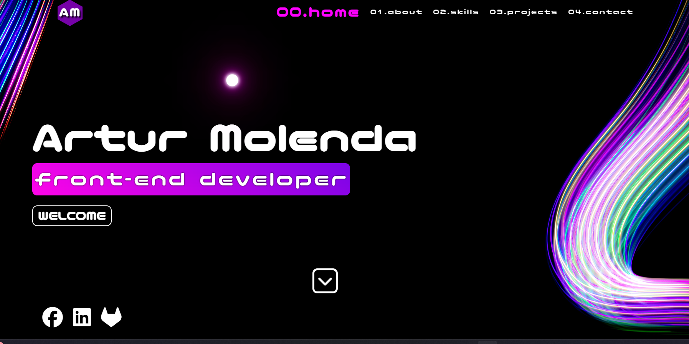

<h1 align="center">artur Molenda - portfolio</h1>
<p>
  
</p>

> This is my portfolio website.

### About The Project

Simple page with cyberpunk and futuristic motives with a little neon lights. 

Link to project: https://arturmolenda.netlify.app/

## Repository

```sh
https://github.com/jesiennart/jesiennart.github.io
```
## Technologies Used


## Features

<ul>
<li>Simple website</Li>
<li>Transparent and user-friendly</Li>
<li>Circle mouse effect</Li>
<li>Text animations</Li>
</ul>

## Screenshots



## Project Status

In progress.

## Room for Improvement

<ul>
<li>More cyberpunk theme, maybe some pictures</Li>
</ul>

## Acknowledgements

This project was inspired by my interests in cyberpunk and Blade Runner world creating with a little help of the synthwave music.

## Author

👤 **Artur Molenda**

* Github: [@jesiennart](https://github.com/jesiennart)

## Contact

Email: artmol@op.pl